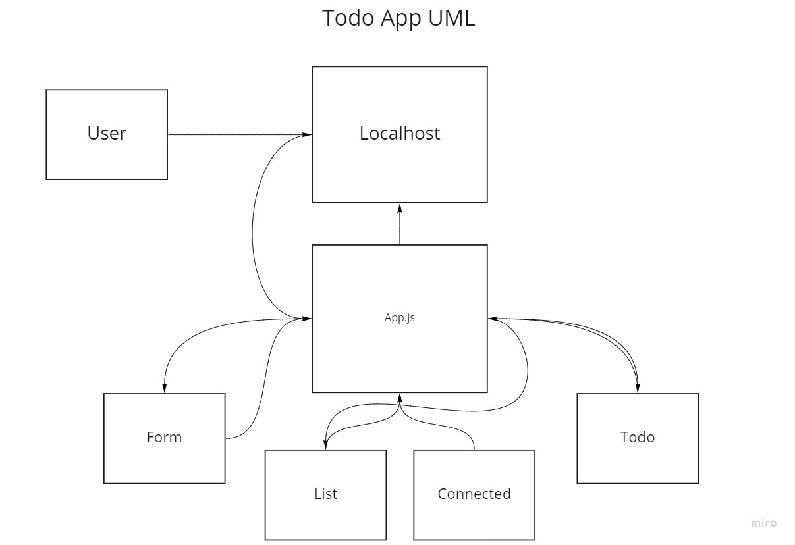

# TODO App

### App Version: 0.04

### Description: This is a Todo application that allows you to add items to your list and check them off as they are finished.

### Languages and Tools:
JavaScript(React), Scss, Bootstrap, Axios, react-hook-form

### UML:

### Collaboration:

Worked with Mark Duenas on certain features (Axios Call, Bootstrap layout)